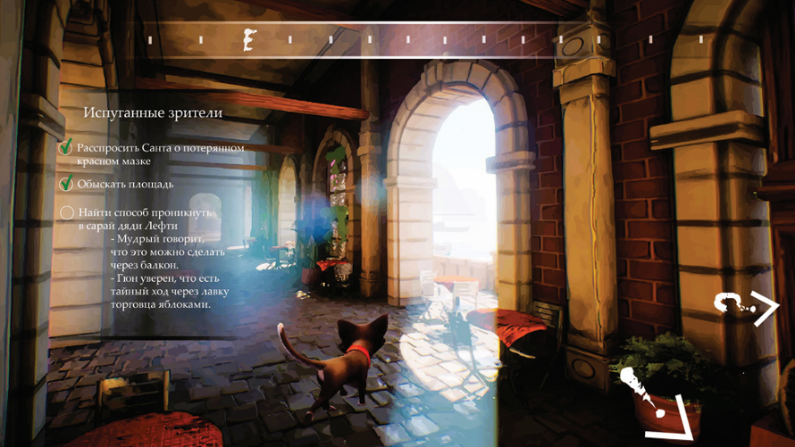
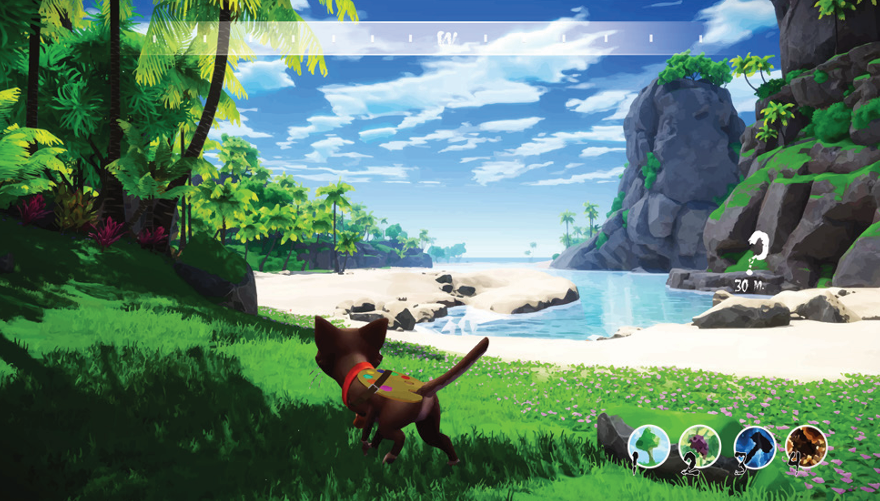
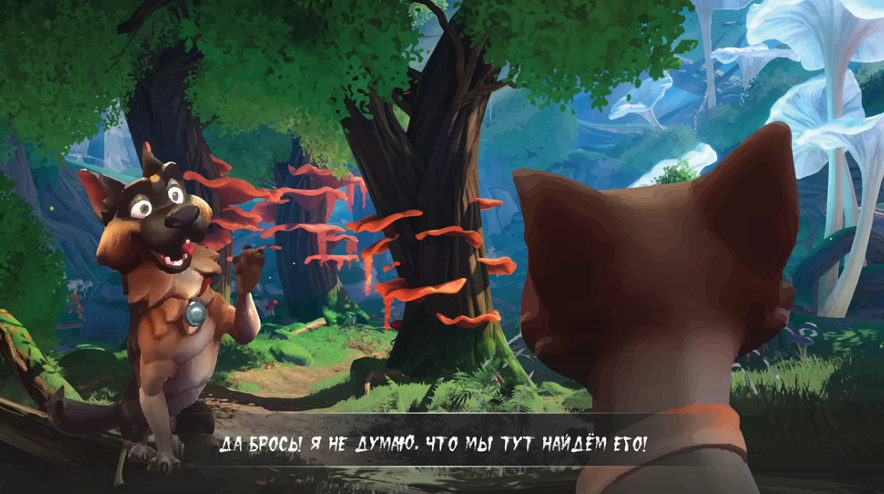

# RELEASE DATE: JULY 2025

# 🎨 Gyshworld Colors

**Gyshworld Colors** is a vibrant and atmospheric adventure game built with Unity. You play as a cat-artist traveling through a colorful world, bringing it to life with your creativity.

## 🐾 About the Game

Embark on a journey through magical landscapes where every step you take paints the world around you. Armed with your brush, colors, and imagination, you'll transform dull environments, help unique characters, and uncover the secrets of Gyshworld.

## Screenshots

### Features

- 🌈 Handcrafted, colorful visual style  
- 🧩 Light puzzles based on color interaction  
- 🎵 Immersive original soundtrack  
- 🐱 Charming protagonist — a traveling cat-artist  

## 🛠️ Built With

- [Unity](https://unity.com/) — Game engine  
- Custom shaders and post-processing for stylized visuals  
- Audio design with FMOD / Unity Audio Mixer

## 📦 Installation

1. Download the latest release from [Releases](https://github.com/your-repo/releases)
2. Unzip the folder
3. Run `GyshworldColors.exe` (Windows) or open the `.app` (Mac)

## 💡 Inspiration

Gyshworld Colors is inspired by a love for expressive art, the philosophy of creative freedom, and games like *Okami*, *Chicory: A Colorful Tale*, and *Journey*.

## 📬 Contact

For feedback, suggestions, or collaborations:  
**Email:** maxsommer003@gmail.com

## 👤 About Me

Hi! I’m the solo developer and producer behind **Gyshworld Colors**.  
I'm passionate about combining visual storytelling, game design, and technology to create emotional, stylized experiences.

As a developer based in Kyrgyzstan, my goal is to build unique games that reflect personal visions and support the growth of the local game development scene.

Feel free to reach out — I’m always open to feedback, collaboration, or just talking games!

---

© 2025 Gyshworld Team. All rights reserved.
